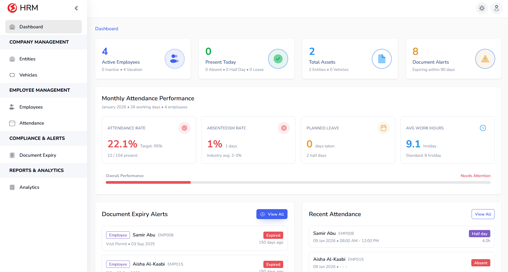
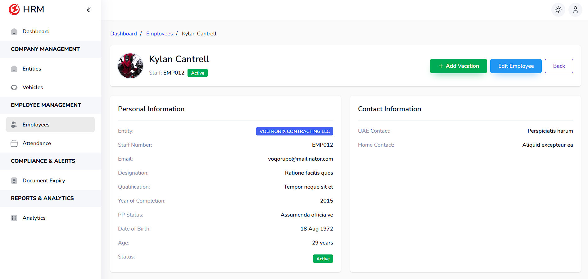
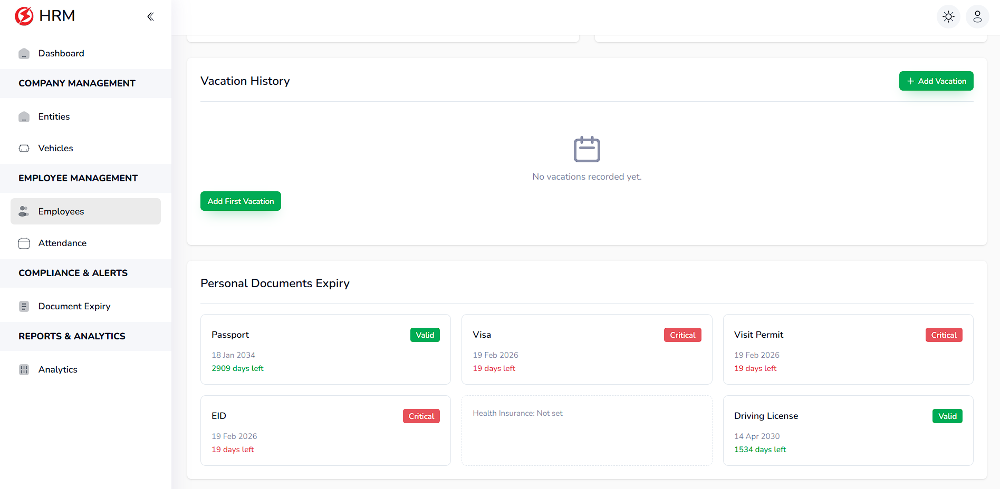
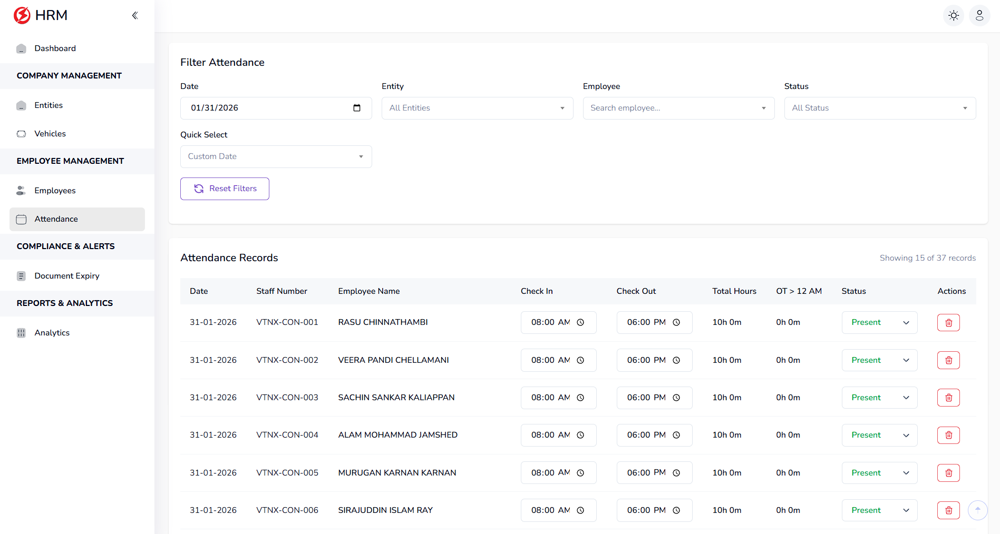
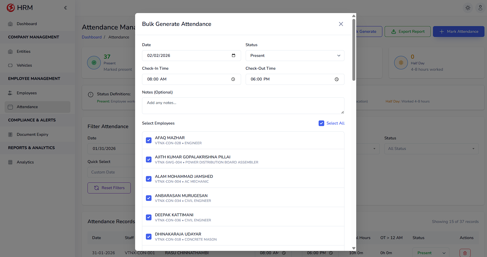
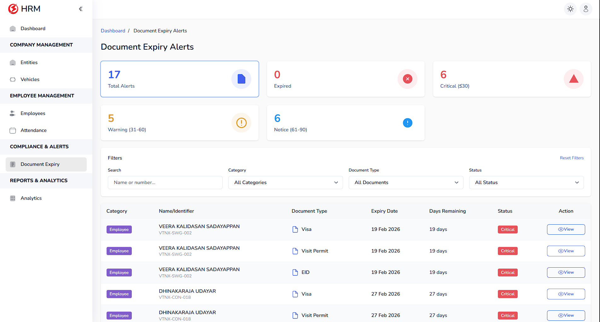
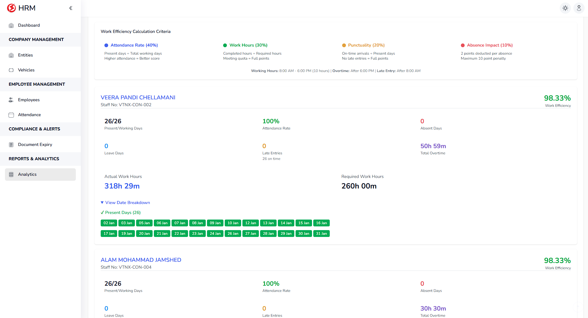
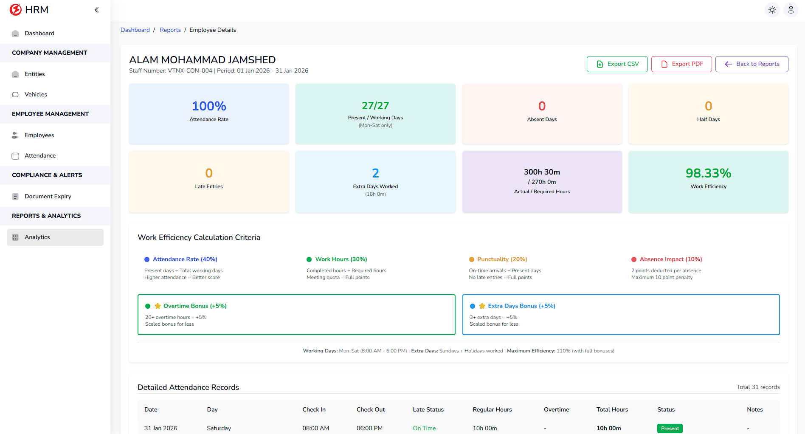

# HRM (Laravel + MySQLi)

An HRM web application built with Laravel to manage employee operations such as attendance, employee profiles, document expiry alerts, overtime tracking, vehicles, and report generation.

## Tech Stack
- Backend: PHP (Laravel)
- Database: MySQL / MySQLi
- Frontend: Blade, jQuery, Bootstrap, HTML, CSS, JavaScript

## Modules / Features
- Authentication (login) and session-based access
- Dashboard
- Employees (create, edit, view, import)
- Attendance tracking (Bulk Generate)
- Overtime management
- Document expiry tracking (alerts/records)
- Entities management
- Vehicles management
- Reports & analytics
  - PDF exports (employee details, analytics, attendance reports)
- Profile management
- Common layouts (header, sidebar, footer)

## Screenshots

